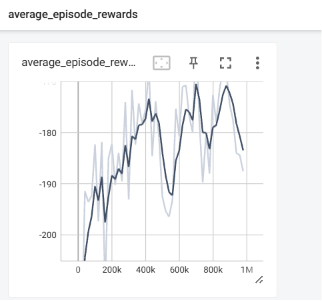
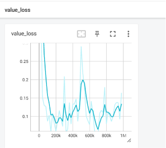
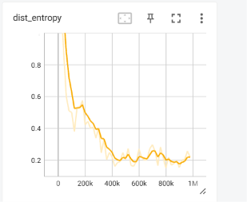
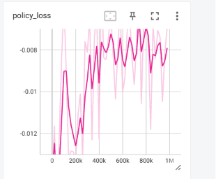

# 本周工作汇报
## MAPPO 论文复现与训练结果分析

**论文：**  
*The Surprising Effectiveness of PPO in Cooperative Multi-Agent Games（NeurIPS 2022）*

---

# 一、本周工作内容

本周主要围绕论文《The Surprising Effectiveness of PPO in Cooperative Multi-Agent Games》开展学习与复现工作。

首先，阅读论文并梳理了 MAPPO 的整体训练流程，重点理解了 CTDE（Centralized Training with Decentralized Execution，集中训练、分散执行）框架、PPO 更新机制以及 MPE（Multi-Agent Particle Environment）中的 Simple Spread 协作任务。

随后，成功搭建论文作者开源代码环境，运行 MAPPO 在 MPE-Simple Spread 场景下的训练，并成功生成 TensorBoard 日志，完成了论文中部分实验的复现。

本周工作的重点不在于提出新的算法，而是验证论文所采用的 MAPPO 训练流程是否能够正常运行和收敛，并观察训练过程中各项指标的变化，为后续进一步修改算法、开展对比实验和分析多智能体协作行为奠定基础。

---

# 二、复现内容

本次复现环境如下：

- **算法：** MAPPO（Multi-Agent PPO）
- **环境：** MPE（Multi-Agent Particle Environment）
- **场景：** Simple Spread
- **Agent 数量：** 3
- **Landmark 数量：** 3
- **PPO Epoch：** 10
- **Episode Length：** 25
- **总训练步数：** 1,000,000

Simple Spread 可以理解为一个多智能体协作占点任务。环境中包含 3 个 Agent 和 3 个 Landmark，多个 Agent 需要在避免碰撞的同时，尽可能分散到不同的 Landmark 附近。每个 Agent 在每一个 Step 都会根据当前观测重新选择动作，多个 Agent 通过共享奖励逐渐形成隐式协作，而不需要进行显式消息通信。

训练完成后，成功生成 TensorBoard 日志，包括：

- Average Episode Rewards
- Value Loss
- Policy Loss
- Dist Entropy
- Ratio 等指标

整体来看，训练过程能够正常进行，各项指标变化趋势与论文中 MAPPO 的训练规律基本一致，说明项目环境、训练脚本和日志记录流程均已成功运行，也完成了论文实验的部分复现。

---

# 三、训练结果分析

## （1）Average Episode Rewards

Average Episode Rewards 反映了智能体整体策略性能的变化，是评价强化学习训练效果最重要的指标之一。

从训练曲线可以看到：

- 训练初期平均奖励约为 **-200**；
- 随着训练进行，平均奖励逐渐提高至 **-180 左右**；
- 虽然训练过程中存在一定波动，但整体趋势持续上升。

由于 Simple Spread 的奖励主要由 **Agent 与 Landmark 的距离** 以及 **碰撞惩罚** 组成，因此奖励不断提高说明：

- Agent 已逐渐学会向 Landmark 靠近；
- 多个 Agent 开始形成一定的协作分工；
- Agent 同时靠近同一 Landmark 或相互碰撞的情况有所减少。

之所以会出现这一变化，是因为所有 Agent 共享团队奖励。当多个 Agent 扎堆到同一位置时，未被覆盖的 Landmark 会使团队总奖励降低；而当三个 Agent 分散到不同 Landmark 附近时，整体距离惩罚会减小。因此，共享奖励机制能够不断引导 Agent 从随机移动逐渐学习到分散占点的协作策略。

虽然最终奖励尚未完全收敛，但已经表现出明显的学习趋势，与论文中 MPE 环境训练曲线的整体变化规律一致。

---

## （2）Value Loss

Value Loss 描述的是 Critic 网络预测状态价值时产生的误差。Critic 在训练阶段可以利用多个 Agent 的全局状态信息，预测从当前状态开始未来可能获得的累计回报。

实验结果表明：

- 训练初期 Value Loss 较大；
- 随后很快下降至较低水平；
- 后期保持在较稳定范围，仅存在一定幅度的小幅波动。

这一变化说明 Critic 网络在训练初期对状态价值的预测并不准确，但随着环境交互数据不断增加，Critic 能够逐渐学习当前状态与未来累计回报之间的关系。

Critic 预测得更加准确后，实际回报与预测价值之间计算得到的 Advantage 也会更加可靠，从而为 Actor 提供更准确的策略更新方向。如果 Critic 长期预测不准确，就可能错误地提高或降低某些动作的概率，因此 Value Loss 的下降和稳定对 PPO 的训练十分重要。

论文指出，Value Function 的稳定训练对于 MAPPO 性能具有重要影响，因此作者建议采用 **Value Normalization** 来减小不同阶段回报尺度变化带来的影响。当前实验中 Value Loss 能够较快下降并保持稳定，说明 Critic 网络整体训练过程正常。

---

## （3）Dist Entropy

Dist Entropy 表示策略输出动作概率分布的随机程度，可以用来衡量 Agent 当前更偏向探索还是利用已有策略。

训练结果可以观察到：

- 初始阶段 Entropy 较高；
- 随着训练进行迅速下降；
- 后期保持在较低且相对稳定的水平。

这说明训练初期 Actor 网络参数尚未形成有效策略，不同动作的概率较为接近，因此 Agent 主要通过随机探索来尝试不同的移动方向。随着训练进行，一些能够提高团队奖励的动作模式被不断强化，Agent 对动作的选择逐渐形成明确偏好，策略由随机探索逐步转向稳定利用。

Entropy 下降的原因是 Actor 输出的动作概率分布逐渐集中。例如训练初期向上、向下、向左、向右的概率可能较为接近；训练后期，当 Agent 观察到 Landmark 和队友位置时，会更明确地选择某一方向，因此动作分布的随机性下降。

这一现象符合 PPO 的训练规律，也说明智能体已经逐渐从“随机移动”过渡到“根据局面进行有倾向性的决策”。不过 Entropy 也不宜过早下降到过低水平，否则可能导致探索不足并陷入局部最优，因此后续可以结合熵系数进一步分析探索程度对训练性能的影响。

---

## （4）Policy Loss

Policy Loss 用于描述 Actor 网络在 PPO 更新过程中的变化情况，反映当前策略相对于旧策略的优化程度。

实验结果显示：

- Policy Loss 在训练初期变化较大；
- 随着训练进行，整体逐渐趋于稳定；
- 训练过程中没有出现持续放大、剧烈震荡或明显发散的现象。

训练初期 Policy Loss 波动较大，是因为 Actor 尚未形成稳定策略，新采集的数据会不断改变动作概率分布。随着训练进行，Agent 已经学会较有效的移动与协作方式，策略更新幅度逐渐减小，因此 Policy Loss 也趋于稳定。

PPO 使用 Clip 机制限制新旧策略之间的变化幅度，即使某一批数据带来了较大的 Advantage，也不会让 Actor 一次性改变过多。这种小步更新机制能够减少策略突然退化的风险，也是当前 Policy Loss 没有明显发散的重要原因。

结合 Average Episode Rewards 的上升以及 Value Loss 的稳定，可以说明 PPO 更新过程整体较为平稳，没有出现明显的策略崩溃现象，整个训练流程运行正常。

---

# 四、实验总结

本周成功完成了论文 MAPPO 在 MPE 环境中的部分复现工作。

实验结果表明：

- 项目能够正常完成训练；
- TensorBoard 能够成功记录并展示训练过程；
- Average Episode Rewards 呈持续提升趋势；
- Value Loss 在训练初期快速下降并逐渐稳定；
- Dist Entropy 从较高水平下降，说明策略由随机探索逐渐转向稳定决策；
- Policy Loss 未出现明显发散，表明 PPO 更新过程整体较为稳定。

整体来看，本次实验结果与论文中 MAPPO 在 MPE 环境中的训练表现基本一致，验证了代码实现及实验配置的正确性。通过本次复现，也进一步理解了 Actor、Critic、Advantage、PPO Clip 和 CTDE 等机制在多智能体训练中的具体作用。

目前的结果可以说明 MAPPO 已经在 Simple Spread 中学到一定的多智能体协作能力，但仅凭训练指标还不能完全说明最终策略已经达到最优。后续还需要结合不同随机种子、参数对比实验以及可视化运行结果，对模型的稳定性和实际协作行为进行进一步验证。

---

# 五、下一步工作计划

1. 对 PPO Epoch 和 Mini-batch 数量进行对比实验。  
   在其他参数保持不变的情况下，分别设置不同的 `ppo_epoch` 和 `num_mini_batch`，比较各组实验的 Average Episode Rewards、Value Loss 和 Dist Entropy 曲线，分析不同参数对收敛速度、最终奖励和训练稳定性的影响。该部分主要验证论文关于“训练轮数过多和 Mini-batch 划分过细可能降低 MAPPO 性能”的结论。

2. 使用多个随机种子验证实验结果的稳定性。  
   在基线配置和较优配置下分别使用 3 个随机种子重复训练，统计各组实验最终奖励的平均值和波动范围，避免仅根据单次实验得出结论。最终可以通过对比表格和多条奖励曲线展示不同配置的稳定性。

3. 对训练完成后的模型进行可视化运行。  
   加载基线模型和较优参数模型，观察三个 Agent 是否能够分散到不同 Landmark、是否存在重复占点和碰撞，并保存关键截图或录屏。该部分从行为层面验证训练曲线所反映的协作能力。

4. 在 Simple Spread 中加入一个轻量级改进实验。  
   在原有共享奖励基础上，增加一个简单的“重复占点惩罚”或“目标覆盖奖励”，例如当多个 Agent 同时靠近同一个 Landmark 时给予额外惩罚，鼓励 Agent 更快形成一对一的目标分配。随后将改进前后的 Average Episode Rewards、碰撞情况和重复占点现象进行对比，分析该奖励设计是否能够加快协作策略的形成。
