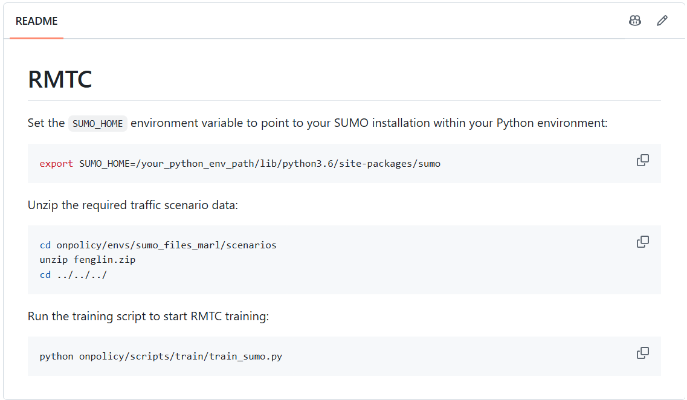
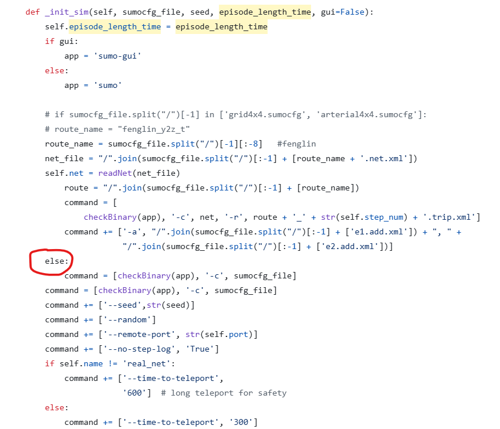
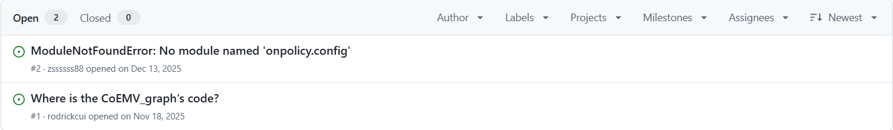

## 一、项目背景与复现目标

RMTC（Role-aware Multi-agent Traffic Control）是一个面向应急交通控制场景的多智能体强化学习项目。其核心目标是利用 SUMO 交通仿真环境与多智能体策略学习框架，对交通信号控制问题进行建模与训练，以提升紧急车辆通行效率。

---

## 二、复现环境与执行方式

### 2.1 运行环境

本次复现主要基于以下条件进行：

- 操作系统：Ubuntu/Linux
- Python 环境：conda 环境中的 Python 3.11
- SUMO 相关组件：`sumo`、`traci`、`sumolib` 可在当前环境中被正常导入
- 训练入口：`python -m onpolicy.scripts.train.train_sumo`

### 2.2 复现步骤

复现过程按如下顺序进行：

1. 读取训练脚本与环境封装代码；
2. 直接执行训练入口；
3. 根据报错信息逐步定位问题来源；
4. 针对参数传递、SUMO 启动逻辑、场景文件加载等环节进行修正；
5. 对每次修正后的结果重新运行，观察是否进入下一阶段。

---

## 三、实际遇到的问题

### 问题一：项目文档与工程说明不足

仓库中的说明文档较为简略，主要停留在“环境变量 + 解压资源 + 运行脚本”的层面，缺少以下关键内容：



- 依赖 Python 版本未加说明：实测需要 Python 3.11 以上版本
- 依赖包列表没有给出：实际路径为```./onpolicy/scripts/requirements.txt```，应执行命令 ```pip install -r onpolicy/scripts/requirements.txt```
- 文档未说明 SUMO 仿真平台如何下载：该平台不能通过 ```pip install sumo``` 下载（sumo实际上为绘图包），实际应该用 ```pip install eclipse-sumo``` 或者用官网的 ```sudo add-apt-repository ppa:sumo/stable1```、```sudo apt-get update```、```sudo apt-get install sumo sumo-tools sumo-doc```命令。环境变量 ```SUMO_HOME``` 的设置也应该为 SUMO 仿真平台的路径。

### 问题二：部分函数存在错误

在 `SUMO_env.py` 的 `__init__sim` 函数中，代码结构存在严重问题：

- **悬空的 `else` 分支**：在定义 `command` 列表后，出现了一个无匹配 `if` 的 `else:` 语句，直接导致 Python 语法错误，解释器无法解析该函数。



- **命令行参数重复追加**：`command += [checkBinary(app), '-c', sumocfg_file]` 这行代码被写了两次，导致 SUMO 启动时收到重复的 `-c` 参数，引发解析混乱。
- **地图文件命名与代码硬编码不一致**：代码中通过 `route_name = sumocfg_file.split("/")[-1][:-8]` 的方式强行截取文件名前缀来拼接 `.net.xml` 和 `.trip.xml` 路径。原代码指定的场景（如 `cologne8_test`）的文件命名结构与地图文件`fenglin`中的实际命名不一致，代码找不到对应的网络文件，只能 Fallback 到预设的备用路径，导致无法自由选择想要使用的地图场景。

### 问题三：场景配置文件路径不一致或缺失

在进一步推进后，程序报出以下错误：

```text
Error: Could not access configuration '.../cologne8.sumocfg'.
```

以及后续回退到默认场景时的提示：

```text
[WARN] configured SUMO config not found, using fallback: .../fenglin/.../base.sumocfg
```

检查后发现，项目开源代码中仅提供了 FengLin 一张地图，且场景文件路径依赖与硬编码耦合较强。

### 问题四（关键）：关键超参数配置文件缺失

训练脚本 `train_sumo.py` 中通过 `argparse` 解析命令行参数，但代码中引用了大量未在脚本中定义的变量（如智能体/车辆数量 `num_ve_agents`）。按工程规范，此类超参数应通过配置文件（如 `.yaml` 或 `config.py`）统一管理，但项目初始版本缺失 `onpolicy/config` 模块。导致运行时会抛出错误`No module named onpolicy.config`。



该问题导致关键超参数缺失，很难复现出论文应有的效果，且项目没有说明超参数类型及取值，很难还原超参数文件。

---

## 四、复现结论

### 4.1 结论概述

从目前的实际运行情况来看，RMTC 项目并不属于“开箱即用”的可直接训练代码库。它更接近于 “可阅读、可分析” 的框架，关键超参数均需要自己设置。

更准确地说，当前版本存在以下几个层面的问题：

| 层面 | 问题类型 | 影响程度 |
|------|----------|----------|
| 文档说明 | 运行说明不足，缺少可复现的工程指导 | 中 |
| 代码错误 | 部分代码存在语法和命名缺陷，导致复现调试难度高 | 中 |
| 场景数据 | 场景文件路径依赖与硬编码耦合较强 | 中高 |
| 参数配置 | 训练和场景的参数配置缺失，且无相关说明 | 高 |

### 4.2 两类问题

遇到的问题主要分为两类：

1. 代码层面的“可运行性问题”
   - 例如参数缺失、启动命令构造错误、路径错误等。
   - 这类问题通常可以通过读取代码和调整配置定位。

2. 研究层面的“复现完整性问题”
   - 例如是否能够完整复现论文中的训练结果、是否需要额外的训练资源、是否依赖特定版本的 SUMO/TraCI/torch 等。
   - 这类问题需要更完整的实验环境与更长时间的调试才能做出结论。

当前阶段，本文档主要关注的是前者，即“代码能否顺利进入训练流程”；即使修复了所有运行有关问题，因为超参数的确实，最后结果也大概率不能复现。

---

## 五、已获得的实践性收获

### 1. 对学术开源代码质量的清醒认识

论文代码开源并不等同于“开箱即用”。许多顶会论文的代码仓库在发表时仍处于“可读但不可跑”的状态。RMTC 项目作为 NeurIPS 2025 的收录论文，其代码质量与论文本身的研究贡献存在明显落差。所以，**在引用开源代码时，务必先验证其可复现性**。

### 2. 形成了更系统的调试方法

通过这次复现尝试，我们建立了一套完整的代码复现排查流程：

```text
环境检查 → 运行入口 → 读报错 → 定位代码位置 → 修复局部问题 → 重新验证
```

每一步都需要耐心和系统性的分析，而非盲目尝试。

---

## 六、总体评价

这次复现尝试虽然尚未成功完成完整训练流程，但已经明确识别出项目中影响可运行性的几个关键工程问题，并通过实际运行日志形成了较为客观的复现观察。就当前仓库状态而言，更准确的评价是：

- 该项目具有较好的研究思想基础；
- 但其工程可复现性仍有明显提升空间；
- 仅从“能否运行”角度看，当前版本仍需要进一步整理和验证，才能达到较低门槛的可复现标准。
